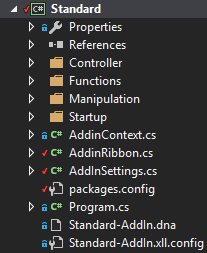

## Program class (the entry point of the add-in)

The class program is the entry point of the add-in as it is thanks to this class that Excel-DNA can register the add-in to Excel. It can be only one class that derive from ** IExcelAddIn** in an add-in. 
This is where you can instantiate objects that you want to keep during the life cycle of the add-in. If you are using an Inversion of Control container, this is where you can start it. 
In the present example, we will only keep a reference to the Excel application.


public class Program : IExcelAddIn
    {
        public void AutoOpen()
        {
            try
            {   
                // The Excel Application object
                AddinContext.ExcelApp = new Application(null, ExcelDnaUtil.Application);
            }
            catch (Exception e)
            {
                LogDisplay.RecordLine(e.Message);
                LogDisplay.RecordLine(e.StackTrace);
                LogDisplay.Show();
            }
        }
 
        public void AutoClose()
        {
            throw new NotImplementedException();
        }
    }



{{site.data.alerts.note}}
<b>Note:</b> The *AutoClose* method is never called during the like cycle of an add-in.
{{site.data.alerts.end}}

## The Start-up folder or bootstrap

Using an Inversion of control container simplify the instantiation of the classes. It instantiates the objects with the appropriate dependencies. In order for the container to do so, it is necessary to register all the classes or single instance objects to it. This process is done when the program is starting.

The registration of the classes and objects is done in the folder “start-up”.  All the registration process could be done in one single file. To ensure that code is easy to read or to update, we suggest to split the process in several files. For example, a file to register the controllers, another one for the single instance (logger, Excel application…), one for the web or WCF services or for the WPF user-interface. 

Part of the files for the registration can be reused between different add-in as they are generic enough. 

## Why do you need controllers?

We can see the ribbon as a View that interact with the user. When the user performs an action on the ribbon the controller receives the request and decide of the appropriate series of actions required. The controller is there to do separate the ribbon (***View***) from the rest of the code..

**Example:** If a button on the ribbon is supposed to open a form, then the request will be passed to the controller which will dispatch, to the appropriate class, the responsibility to open the form requested. The controller act as a middle-man. His only purpose is to simplify the exchange of message between the view and the rest of the program.

Usually the controls part of a group in a tab are related in terms of business process (Reporting, Analytics, Accounting…). Creating one controller per group can helps to put all the calls related to the same business process together and improve the clarity of the code.

## The configuration file name (app.config)

When using an configuration file (app.config), it is important to name it the same way than the “.dna” file and with the extension “.xll.config”. 

<b>Example:</b> if the “.dna” file is named <i>“Standard-AddIn.dna”</i> then the configuration file need to be named <i>“Standard-AddIn.xll.config”</i>

## The Add-in Context?

The Add-in context is a static object that keep a reference to single objects like:

*   the Excel Application, we want to have only one instance in the add-in
*   the Add-in Settings
*   The token cancellation: it enables cooperative cancellation between threads which is useful when the add-in performs a task in the background while Excel is trying to close.
*   The Inversion of Control container. 

As it is a static class then it is possible to call it from anywhere in the application. The instantiation of it properties should be done at the initialization of the add-in and released before the closure of the add-in.

## The use of a setting class?

A setting class can be used to keep information related to the add-in. Some information can be read from the configuration file or retrieve during the execution of the add-in. The information stored in the configuration file can be the add-in name and the version number. The information retrieve during the execution can be the full path of the location of the add-in and the current user login.

### Why will you need those information?

The information about the current user can be linked to a security services to retrieve the list of actions that can be performed by this user. When the add-in is saving / updating data, it is important to ensure that only the appropriate person can do so.  This way users will only be able to perform actions which are in line with his position or team. 

Having information about the add-in version, name and path can be part of a strategy to upgrade the add-in when a new version is available.

