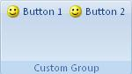

## Box

**Definition**: A box is a container used to arrange controls within a group. The controls part of a box can be display either vertically or horizontally. 

For example, consider a group of controls that are laid out horizontally, as follows:

### How to create it?

This layout is specified using the following code

	.Items(d =>
	{
	    d.AddBox().SetId("box")
	        .HorizontalDisplay()
	        .AddItems(i =>
	        {  
	            i.AddButton("Button 1")
	            	.SetId("button1")
	                .NormalSize()
	                .ImageMso("HappyFace");

	            i.AddButton("Button 2")
	               .SetId("button2")
	               .NormalSize()
	               .ImageMso("HappyFace");
	        });
	});


### Events

It is possible to apply the following events to a box

*	*Visible*: The condition requires to show the box container

### Children

It is below controls can be added to a box

*	Box, Button, Checkbox, Combo-box, Dropdown, Menu, Gallery, Edit box, Label, Toggle button
