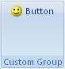

## Button 

**Definition**: A button can either be small or large with and image or not. When clicked, it will call a specific action. 
 
For example, consider a button control, as follows:

### How to create it?

This is specified using the following code


	.Items(d =>
	{
	    d.AddButton("Button")
	        .SetId("buttonOne")
	        .NormalSize()
	        .ImageMso("HappyFace");
	});


### Events

It is possible to apply the following events to a button

*	*Visible*: The condition requires to show the control
*	*Enable*: The condition requires to enable the control
*	*Action*: Define the action that will be done when the control is clicked

**Example**

Let's add the following events to the button:

* Show the button if there is more than one sheet in the Workbook
* Enable the button if there is more than two sheet in the Workbok
* When the button is clicked, display a message box saying "Well Done !!!"


    protected override void CreateRibbonCommand(IRibbonCommands cmds)
    {
        cmds.AddButtonCommand("buttonOne")
            .IsVisible(() => AddinContext.ExcelApp.Worksheets.Count() > 1)
            .IsEnabled(() => AddinContext.ExcelApp.Worksheets.Count() > 2)
            .Action(() => MessageBox.Show("Well done !!!"));
    }


{{site.data.alerts.tip}}In order for the ribbon to refresh when the number of sheet in the workbook changes, we need to add some code.{{site.data.alerts.end}}

In the method **OnOpening**, we need to refresh the ribbon when there is a change on a Excel sheet.


    public override void OnOpening()
    {
        AddinContext.ExcelApp.SheetActivateEvent += (e) => Ribbon?.Invalidate();
        AddinContext.ExcelApp.SheetChangeEvent += (a, e) => Ribbon?.Invalidate();
    }

{{site.data.alerts.note}} We are using the Excel application from <b>NetOffice.ExcelApi</b> {{site.data.alerts.end}}