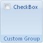

## Checkbox

**Definition**: A checkbox is useful if we want to use a control that has two state. When clicked the event will receive the new state of the control so it is possible to specify the behavior based on the state of the checkbox. 

For example, consider a checkbox control, as follows:

### How to create it?

This is specified using the following code


	.Items(d =>
	{
		v.AddCheckbox("CheckBox")
		   .SetId("checkboxId");
	});


### Events

It is possible to apply the following events to a checkbox

*	*Visible*: The condition requires to show the control
*	*Enable*: The condition requires to enable the control
*	*Action*: Define the action that will be done when the control is clicked
*	*Pressed*: Define the initial state of the checkbox (checked or not)

**Example**

Let's add the following events to the checkbox:

* When the user click on the checkbox to *check* it then display a message box saying "Check-box pressed"
* When the user click on the checkbox to *un-check* it then display a message box saying "Check-box NOT pressed"
* Define the initial state of the checkbox as checked


    protected override void CreateRibbonCommand(IRibbonCommands cmds)
    {
	    cmds.AddCheckBoxCommand("checkboxId").Action(isPressed =>
	    {
	        if (isPressed)
	        {
	            MessageBox.Show(@"Check-box pressed");
	        }
	        else MessageBox.Show(@"Check-box NOT pressed");	        
	    }).Pressed(() => true);
	}
