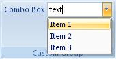

## Combo box

**Definition**: A combo-box allows a user to input a text string or select one from a list. It can be great to display the list of sheets name of the current workbook. The content of a combo-box can be defined while creating the UI or dynamically in a routine.
 
For example, consider a combo box control, as follows:

### How to create it?

This is specified using the following code


   .Items(d =>
   {
       d.AddComboBox("Combo Box")
            .SetId("ComboBoxId")
            .ShowLabel().NoImage()
            .AddItems(v =>
            {
                v.AddItem("Item 1").SetId("item1Id");
                v.AddItem("Item 2").SetId("item2Id");
                v.AddItem("Item 3").SetId("item3Id");
            });
   });


### Events

It is possible to apply the following events to a label

*	*Visible*: The condition requires to show the control
*	*Enable*: The condition requires to enable the control
*	*OnChange*: Define the action that will be done when the selection changes
*	*GetText*: Define the initial text that will be displayed by the control

**Example**

* The combo-box initial value will be "Text"
* When the user select a new value in the combo-box. A message box is displayed saying "New selection" with the label of the selected value.


  protected override void CreateRibbonCommand(IRibbonCommands cmds)
  {
      cmds.AddComboBoxCommand("ComboBoxId")
          .GetText(() => "Text")
          .OnChange((value) => MessageBox.Show(@"New selection:" + value));
  }


### Dynamic Items

When the content of the combo-box is defined dynamically, the following events need to be filled (at minimum the first 3):

*	*ItemCount*:  Get the number of item of the combo-box
*	*ItemID*: Get the ID of the item
*	*ItemLabel*: Get the label of the item
*	*ItemScreentip*: Get the screentip  of the item **(facultative)**
*	*ItemSupertip*: Get the enhanced screentip of the item **(facultative)**

**Example**

* Considering an object *content* having a list of items (id, label, supertip). It is possible to load dynamically the combo-box with that object.
* Firstly the definition of the combo-box need to be modified in the method **CreateFluentRibbon** as follow :


    .Items(d =>
    {
       d.AddComboBox("Combo Box")
        .SetId("ComboBoxId")
        .ShowLabel().NoImage()
        .DynamicItems();
    });


* Then in the method **CreateRibbonCommand**, we can define how the combo-box get populated.


    protected override void CreateRibbonCommand(IRibbonCommands cmds)
    {
        cmds.AddComboBoxCommand("ComboBoxId")
            .ItemCounts(content.Count)
            .ItemsId(content.Ids)
            .ItemsLabel(content.Labels)
            .ItemsSupertip(content.SuperTips)
            .GetText(() => "Text")
            .OnChange((value) => MessageBox.Show(@"New selection:" + value));
    }

