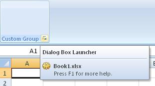

## Dialog-box launcher

**Definition**: A dialog box launcher is a control at the *group* level that act like a button. 
 
For example, consider a dialog-box launcher control, as follows:

### How to create it?

This is specified using the following code


	g.AddGroup("Custom Group")
	    .SetId("CustomGroupId")
	    .Items(d =>
	    {
	        ...
	    })
	    .DialogBoxLauncher(i => 
	    	i.AddDialogBoxLauncher()
	           .SetId("dialogboxId")
	           .Screentip("Dialog Box Launcher"));



### Events

It is possible to apply the following events to a button

*	*Visible*: The condition requires to show the control
*	*Enable*: The condition requires to enable the control
*	*Action*: Define the action that will be done when the control is clicked

**Example**

* When the user click on the dialog box launcher, a message box is displayed saying "Dialog Box clicked"


    protected override void CreateRibbonCommand(IRibbonCommands cmds)
    {
        cmds.AddDialogBoxLauncherCommand("dialogboxId")
            .Action(() => MessageBox.Show("Dialog Box clicked"));
    }
