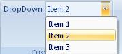

## Dropdown

**Definition**: It similar to a combo-box at the exception that it is possible to displaying image with text. The content of a dropdown can be defined while creating the UI or dynamically in a routine.
 
For example, consider a drop-down control, as follows

### How to create it?

This is specified using the following code:


	.Items(d =>
	{
	   d.AddDropDown("DropDown")
            .SetId("dropdownId")
            .ShowLabel().NoImage()
            .ShowItemLabel().HideItemImage()
            .AddItems(v =>
            {
                v.AddItem("Item 1").SetId("item1Id");
                v.AddItem("Item 2").SetId("item2Id");
                v.AddItem("Item 3").SetId("item3Id");
            });
	});


### Events

It is possible to apply the following events to a dropdown

*	*Visible*: The condition requires to show the control
*	*Enable*: The condition requires to enable the control
*	*Action*: Define which action to take based on the current selected value
*	*SelectedItemIndex*: Get the index of the selected item. (Can get the index in the *Action* event)

## Example

* Based on the position of the item clicked by the user, a message box will be displayed with a specific string


    protected override void CreateRibbonCommand(IRibbonCommands cmds)
    {
        cmds.AddDropDownCommand("dropdownId")                
            .Action(index =>
            { 
                MessageBox.Show(@"Your selection:" + (index+1));
            });
    }

 
### Dynamic Items

When the content of the dropdown is defined dynamically, the following events need to be filled (at minimum the first 3)::

*	*ItemCount*:  Get the number of item of the combo-box
*	*ItemID*: Get the ID of the item
*	*ItemLabel*: Get the label of the item
*	*ItemImage*: Get the image of the item **(facultative)**
*	*ItemScreentip*: Get the screentip  of the item **(facultative)**
*	*ItemSupertip*: Get the enhanced screentip of the item **(facultative)**

**Example**

* Considering an object *content* having a list of items (id, label, image, supertip). It is possible to load dynamically the dropdown with that object.
* Firstly the definition of the dropdown need to be modified in the method **CreateFluentRibbon** as follow :


    .Items(d =>
    {
       d.AddDropDown("DropDown")
            .SetId("dropdownId")
            .ShowLabel().NoImage()
            .ShowItemLabel().ShowItemImage()
            .DynamicItems();
    });


* Then in the method **CreateRibbonCommand**, we can define how the dropdown get populated.


    protected override void CreateRibbonCommand(IRibbonCommands cmds)
    {
        cmds.AddDropDownCommand("dropdownId")
            .ItemCounts(content.Count)
            .ItemsId(content.Ids)
            .ItemsLabel(content.Labels)
            .ItemsImage(() => content.Images())
            .ItemsSupertip(content.SuperTips)
            .Action(index =>
            { 
                MessageBox.Show(@"Your selection:" + (index+1));
            });
    }
