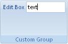

## Edit box

**Definition**: A edit box allows the user to input text.
 
For example, consider an edit box control, as follows:

### How to create it?


	.Items(d =>
	{
		d.AddEditbox("Edit Box")
		    .SetId("editBoxId");
	});


### Events

It is possible to apply the following events to an edit box

*	*Visible*: The condition requires to show the control
*	*Enable*: The condition requires to enable the control
*	*OnChange*: Define the action that will be done when the content of the control is changed
*	*GetText*: Define the initial text of the control

 **Example**

how the events *OnChange* and *GetText* can be used for the edit-box below:



    private string editboxValue;

    protected override void CreateRibbonCommand(IRibbonCommands cmds)
    {
        cmds.AddEditBoxCommand("editBoxId")
            .OnChange(newValue =>
            {
                editboxValue = newValue;
                // You can invalidate a specific control here
                //example:  Ribbon.InvalidateControl("labelControlId");
            })
            .GetText(() => "Text");

        //// Example with a control using the editboxValue:
        // cmds.AddLabelCommand("labelControlId")
        //    .GetLabel(() => editboxValue);
    }
