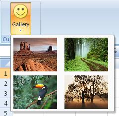

## Gallery

**Definition**: A gallery is an array of elements of dimension defined by the fields *"columns"* and *"rows"*. The elements can be either image alone, with text or text only. It provides more freedom on how to display the elements. It is possible to define the height and width of the elements.
 
For example, consider a gallery control that shows a selection of pictures, as follows:

### How to create it?

This is specified using the following code


	    .Items(d =>
	    {
	         d.AddGallery("Gallery").SetId("galleryIdOne")
           	  .ShowLabel().LargeSize().ImageMso("HappyFace")
           	  .HideItemLabel().ShowItemImage()
	          .AddItems(v =>
	          {
	              v.AddItem("Desert").SetId("Item1").ImagePath("desertImage");
	              v.AddItem("Forest").SetId("Item2").ImagePath("forestImage");
	              v.AddItem("Toucan").SetId("Item3").ImagePath("toucanImage");
	              v.AddItem("Tree").SetId("Item4").ImagePath("treeImage");
	          })
	          .ItemHeight(88).ItemWidth(68);
	    });


For simplicity the image are stored as [project resources](https://msdn.microsoft.com/en-us/library/7k989cfy(v=vs.90).aspx). To retrieve them, you will need to overwrite the method **OnLoadImage** and define based on the *imageName* parameter how the image will be retrieved.


    public override Bitmap OnLoadImage(string imageName)
    {
        switch (imageName)
        {
            case "desertImage":
                return Properties.Resources.Desert;
            case "forestImage":
                return Properties.Resources.Forest;
            case "toucanImage":
                return Properties.Resources.Toucan;
            case "treeImage":
                return Properties.Resources.Tree;
        }
        return Properties.Resources.Island;
    }


### Events

It is possible to apply the following events to a gallery

*	*Visible*: The condition requires to show the control
*	*Enable*: The condition requires to enable the control
*	*Action*: Define which action to take based on the current selected value
*	*SelectedItemIndex*: Get the index of the selected item. (Can get the index in the *Action* event)

## Example

* Based on the position of the item clicked by the user, a message box will be displayed with a specific string


    protected override void CreateRibbonCommand(IRibbonCommands cmds)
    {
        cmds.AddGalleryCommand("galleryIdOne").Action(position =>
        {
            switch (position)
            {
                case 0:
                    MessageBox.Show("Desert image clicked");
                    return;
                case 1:
                    MessageBox.Show("Forest image clicked");
                    return;
                case 2:
                    MessageBox.Show("Toucan image clicked");
                    return;
                case 3:
                    MessageBox.Show("Tree image clicked");
                    return;
            }
        });
    }


### Dynamic Items

When the content of the dropdown is defined dynamically, the following events need to be filled (at minimum the first 3)::

*	*ItemCount*:  Get the number of item of the combo-box
*	*ItemID*: Get the ID of the item
*	*ItemLabel*: Get the label of the item
*	*ItemImage*: Get the image of the item **(facultative)**
*	*ItemScreentip*: Get the screentip  of the item **(facultative)**
*	*ItemSupertip*: Get the enhanced screentip of the item **(facultative)**

**Example**

A gallery with dynamic items will be create as follow in the method **CreateFluentRibbon**


    .Items(d =>
    {
        d.AddGallery("Dynamic Gallery")
         .SetId("DynamicGalleryId")
         .ShowLabel().NoImage()
         .ShowItemLabel().ShowItemImage()
         .DynamicItems();
    }


It is necessary to define how to items are populated and it needs to be defined in methods **CreateRibbonCommand**. Below is an example of it of 2 items populated dynamically. 


    private int gallerySelectedIndex;

    protected override void CreateRibbonCommand(IRibbonCommands cmds)
    {
    	cmds.AddGalleryCommand("DynamicGalleryId")
            .ItemCounts(() => 2)
            .ItemsId(() => new object[] {"item1", "item2" })
            .ItemsLabel(() => new[] { "First Item", "Second Item" })
            // Images of numbers "one" and "two"
            .ItemsImage(() => new object[] {Properties.Resources.one, Properties.Resources.two})
            .ItemSelectionIndex(() => gallerySelectedIndex)
            .Action(i =>
            {
            	gallerySelectedIndex = i;
                MessageBox.Show(@"Your selection: " + (i+1));
            });
    }


### Children

The following controls can be attached to a gallery

*	Item and button. 
