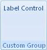

## Label Control

**Definition**: It represent a label. It can be used if we want to display a specific text in the ribbon to notify the user about something.
 
For example, consider an label control, as follows:

### How to create it?

This is specified using the following code:


	.Items(d =>
	{
		d.AddLabelControl()
		    .SetId("labelId");
	});


The label is defined dynamically using the *GetLabel* event (See below).

### Events

It is possible to apply the following events to a label

*	*Visible*: The condition requires to show the control
*	*Enable*: The condition requires to enable the control
*	*GetLabel*: Define the text that will be display. It can be changed dynamically 


	protected override void CreateRibbonCommand(IRibbonCommands cmds)
	{
		cmds.AddLabelCommand("labelId")
		     .GetLabel(() => "Label Control");
	}

