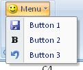

## Menu

**Definition**: A menu displays a list of commands and can be compose of sub-menu.
 
For example, consider a menu control, as follows:

### How to create it?

This is specified using the following code:


       .Items(d =>
       {
           d.AddMenu("Menu")
               .SetId("menuId").ShowLabel()
               .ImageMso("HappyFace").NormalSize()
               .ItemNormalSize().AddItems(v =>
               {
                   v.AddButton("Button 1")
                       .SetId("button1Id")
                       .ImageMso("FileSave");

                   v.AddButton("Button 2")
                       .SetId("button2Id")
                       .ImageMso("Bold");

                   v.AddButton("Button 3")
                       .SetId("button3Id")
                       .ImageMso("Undo");
               });

       });


### Events

It is possible to apply the following events to a menu

*	*Visible*: The condition requires to show the control
*	*Enable*: The condition requires to enable the control

### Children

The following controls can be attached to a menu

*	Button, checkbox, menu, gallery, toggle button. 
