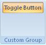

## Toggle button

**Definition**: A toggle button is a specific class of button which has the same behavior than a checkbox meaning that it can only have two states (ON and OFF). 
 
For example, consider a toggle button control, as follows:

### How to create it?

This is specified with the following code


	.Items(d =>
	{
		d.AddToggleButton("Toggle Button")
	            .SetId("ToggleButtonId");
	});


### Events

It is possible to apply the following events to a toggle button

*	*Visible*: The condition requires to show the control
*	*Enable*: The condition requires to enable the control
*	*Action*: Define the action that will be done when the control is clicked
*	*Pressed*: Define the initial state of the toggle button (ON or OFF) 

**Example**

Let's add the following events to the checkbox:

* When the user click on the toggle button to *check* it then display a message box saying "Toggle button pressed"
* When the user click on the toggle button to *un-check* it then display a message box saying "Toggle button NOT pressed"
* Define the initial state of the Toggle button as checked


    protected override void CreateRibbonCommand(IRibbonCommands cmds)
    {
	    cmds.AddToggleButtonCommand("ToggleButtonId").Action(isPressed =>
	    {
	        if (isPressed)
	        {
	            MessageBox.Show(@"Toggle button pressed");
	        }
	        else MessageBox.Show(@"Toggle button NOT pressed");	        
	    }).Pressed(() => true);
	}
