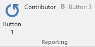

Let's have a quick view of the structure of a ribbon. A ribbon is composed of **tabs** which are themselves composed of **groups**. Controls like button, dropdown, menu are part of an **group**. In most case, an add-in will have only one **tab** which will contain one or more **groups**. The most common control that will be used is a **button**.

## The AddInContext class

In a new class project, create a static class named ***AddinContext*** that will keep the objects that you want to be unique in the application like Excel application instance, logger, an inversion of control container or a token cancellation. It will also be easier to dispose them when Excel closes


    public static class AddinContext
    {
        public static Application ExcelApp { get; set; }
    }

{{site.data.alerts.note}}
We have a reference to <b>NetOffice.ExcelApi;</b>
{{site.data.alerts.end}}

## Program class (the entry point)

Name the starting class ***Program*** and it needs to be inheriting from  ***IExcelAddIn*** (ExcelDna.Integration).
Only the method *AutoOpen* need to be filled.

In the *AutoOpen* method we will instantiate the unique instance of the Excel application from the *AddinContext* created above. 


    public class Program : IExcelAddIn
    {
        public void AutoOpen()
        {
            // The Excel Application object
            AddinContext.ExcelApp = new Application(null, ExcelDnaUtil.Application);
        }

        public void AutoClose()
        {
            throw new NotImplementedException();
        }
    }


## The ribbon class

Create a new class named ***Ribbon*** and it needs to be inheriting from  ***RibbonFluent*** (AddinX.Ribbon.ExcelDna).
This class must be **ComVisible** in order for Excel-DNA to use it.

The following inherited methods will be created:

* **CreateFluentRibbon** : This is where you will define the UI part of the ribbon.
* **CreateRibbonCommand** : This is where you will define the callbacks methods for the controls using the control's unique identifier.
* **OnClosing** : This is where you can dispose objects from the **AddinContext** class before Excel closes.
* **OnOpening** : This method is mainly used to listen to Excel's events


    [ComVisible(true)]
    public class Ribbon : RibbonFluent
    {
        protected override void CreateFluentRibbon(IRibbonBuilder build)
        {
        }

        protected override void CreateRibbonCommand(IRibbonCommands cmds)
        {
        }

        public override void OnClosing()
        {
        }

        public override void OnOpening()
        {
        }
    }


## Creating the first ribbon
 
 We are going to create the first group with the 3 buttons from the above image.

 * Those three buttons are in the same group named "Reporting".
 * One of those buttons is large while the other two are smalls.
 * The first button is large and is named "Button 1" and use the Microsoft image "repeat".
 * The two others buttons are smalls and are respectively named "Contributor" and "Button 3".
 * The button "Contribitors" don't have an image while the button "Button 3" is using the Microsoft image "Bold".

 We are going to see how to do it, it's quick and easy to do!!!

 

**Creating the new tab and group**

Inside the inherited method *CreateFluentRibbon*, we will define the UI part. We will start by adding a tab and a group in the ribbon.


	builder.CustomUi.Ribbon.Tabs(c =>
	{
		c.AddTab("Sample").SetId("SampleTab")
		    .Groups(g =>
		    {
		        g.AddGroup("Reporting").SetId("ReportingGroup")
		            .Items(); 
		    });
	});


**Adding buttons to the group**

Then we will add the buttons. We will create one large button with a [Microsoft Office image](https://imagemso.codeplex.com/) and a box with two regular size button. 

To do so we will replace the code above *.Items()* by the below.


	.Items(d =>
	{
	    d.AddButton("Button 1")
	        .SetId("button1")
	        .LargeSize()
	        .ImageMso("Repeat");

	    d.AddBox().SetId("ReportingBox")
	        .HorizontalDisplay()
	        .AddItems(i =>
	        {  
	            i.AddButton("Button 2").SetId("button2")
	                .NormalSize().NoImage().ShowLabel()	                
	                .Screentip("Button 2")
                    .Supertip("Displays a message box");

	            i.AddButton("Button 3")
	               .SetId("button3")
	               .NormalSize()
	               .ImageMso("Bold");
	        });
	});


{{site.data.alerts.note}}
 A <strong>screentip</strong> is a text that will be display when the control is hovered with the pointer of the mouse.  
{{site.data.alerts.end}}

{{site.data.alerts.note}}
 A <strong>supertip</strong> is a non-bold screentip.
{{site.data.alerts.end}}

## The callback events

After adding the elements that will be part of the ribbon, it is necessary to define the events commands for those elements. In other terms, define how those elements will behave. The most common events are **Enable** and **Visible**, those events can be defined for nearly any elements part of a ribbon.

* **Enable** is called to define if the control should be enabled or not.
* **Visible** is called to define what condition need to be meet to display a control or group of controls. 

Another important one is **Action** which is used to define the action that will be done when a control is clicked or selected.The elements are reference using them identifier defined during the creation of the ribbon.

The code that will be used to define those events is the following:


    protected override void CreateRibbonCommand(IRibbonCommands cmds)
    {
        // Reporting Group
        cmds.AddButtonCommand("button3")
            .IsEnabled(() => AddinContext.ExcelApp.Worksheets.Count() > 2)
            .Action(() => MessageBox.Show("button 3 clicked"));

        cmds.AddButtonCommand("button2")
            .Action(() => MessageBox.Show("To enable the button 3 you need to have 3 sheets."));

        cmds.AddButtonCommand("button1")
            .Action(() => MessageBox.Show("Add one more sheet"));

        cmds.AddBoxCommand("ReportingBox")
            .IsVisible(() => AddinContext.ExcelApp.Worksheets.Count() > 1);
    }


* When clicking on the button *Button 1* a message box will be display stating "Add one more sheet".
* Adding one more sheet will trigger the visibility condition for the box containing the two small buttons. The buttons will be visible if there is more than one sheet in the workbook.
* To enable the button *Button 3*, it is necessary to add an extra sheet as the condition to enable that button is to have more than two sheets.

In the method **OnOpening**, we need to refresh the ribbon when there is a change on a Excel sheet.


    public override void OnOpening()
    {
        AddinContext.ExcelApp.SheetActivateEvent += (e) => Ribbon?.Invalidate();
        AddinContext.ExcelApp.SheetChangeEvent += (a, e) => Ribbon?.Invalidate();
    }

{{site.data.alerts.note}} We are using the Excel application from <b>NetOffice.ExcelApi</b> {{site.data.alerts.end}}