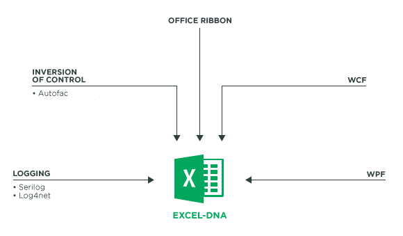

## Current trend

Tactical tools are developed iteratively as users' needs are changing constantly. There is no secret formula or perfect tool. We are in a world where it is needed to reinvent ourselves.

It takes 9 to 12 month for a tool to become obsolete due to the new market needs. It implies the necessity to evolve the tools that we are using.

It is also the case for the consumers. They are more and more in demand and have this constant need of novelty. The actual society create a form of tiredness in people. It is mandatory to bring in a regular basis performant tools to keep users' focus.

## What is a tactical tool

A tactical tool is a tool that can be implemented in a short period of time. It replies to a specific problematic. It requires 1 to 3 months to implement a tactical tool replying to users’ needs.

Those tools are usually created to allow users to consolidate several sources of data coming from web services, text files or databases in order to transform, aggregate the data, or simply, to produce reports.

Those tools integrate in the Office suite (Excel, Word, Outlook…) and increase the functionalities of that suite. They are commonly named "add-in". In the case of Excel, for example, those "add-ins" can be used to include new formulas and / or new functionalities.

In theory, this type of tool has a life time relatively short: 1 to 2 years' maximum.  The users' needs are evolving with the time. It is necessary to adapt the tool to the usage done with it and then integrate changes that occurs in users' work methodology. This type of tool replies to those expectation as it is usually requiring a short period of time to create and integrate a new module or component.

## What is add-in X 

Add-in X is a toolkit composed of several libraries to create robust add-in (tactical tool) using the open-source projects <a href="http://excel-dna.net/">Excel-DNA</a> . It encapsulates the complexity so the developer can start implementing quickly quality and robust tool. This way he creates added value from day one. 

The adventure started mid-2015 after realizing that there is currently an existing gap in the market for Excel add-in. It is possible to find many projects for web developers but only few for Excel add-ins. The goal is to do a step in the right direction so more people can implement add-in for Excel in a short period of time.

## Usage domain

Numerous are the employees that spend an important part of them day collecting data coming from several sources, transforming them with the objective to draw conclusions and then produce added value for the company.

When those tasks, which consist to manipulate the data become recurrent, it becomes then necessary to simplify those operation using a tactical tool that will reproduce the process. Doing so, the user will be able to produce more added value as the process of collecting and transforming the data are done by the tactical tool.

The tactical tools will be useful for users working on a daily basis on the Office suite and who manipulate data through-out the day. It will be help them to collect data from the web to generate Excel pivot-table or generate reports from data stored in a database, or to simplify heavy Excel formulas. It is possible to encapsulate this complexity in a tactical tool. 
