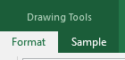
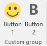

You can download [the sample](https://github.com/AddinX/Sample.Ribbon) from github or use the following command line.


git clone https://github.com/AddinX/Sample.Ribbon.git


{{site.data.alerts.note}}
The code for the contextual tab is in <b>Ribbon2</b>
{{site.data.alerts.end}}

## Tabs and groups

The Ribbon contains multiple tabs, each with several groups of controls. You will use these tabs to perform the most common tasks in Excel.

You can customize the Ribbon by creating your own tabs with whichever controls you want. Controls are always housed within a group, and you can create as many groups as you want in order to keep your tab organized. If you want, you can even add controls to any of the default tabs, as long as you create a custom group in the tab.

**Contextual tabs**

Contextual tabs are special types of tabs that appear only when a particular object is selected, such as a chart or a shape. These contextual tabs contain commands specific to whatever object you are currently working on so Excel's ribbon hide contextual tabs that you can't use on your current selection. 

For example, after you add a shape to a spreadsheet, a new Format tab appears. This is not a standard tab, but a contextual tab — meaning it activates only when you work with a shape.

**Example**

* Let's create a contextual tab named *"Sample"* in the TabSet **Drawing** which is displayed when a shape is activated.
* We will include two buttons inside a group named *"Custom group"*


    protected override void CreateFluentRibbon(IRibbonBuilder build)
    {
        build.CustomUi.Ribbon.ContextualTabs(tabs =>
            tabs.AddTabSet(set => set.SetIdMso(TabSetId.TabSetDrawingTools)
                .Tabs(tab => tab.AddTab("Sample").SetId("SampleContextId")
                    .Groups(g => g.AddGroup("Custom group").SetId("CustomGroupContextId")
                        .Items(d =>
                        {
                            d.AddButton("Button 1").SetId("Button1")
                                .LargeSize().ImageMso("HappyFace");
                            d.AddButton("Button 2").SetId("Button2")
                                .LargeSize().ImageMso("Bold");
                        })
                    )
                )
            )
        );
    }	


Below is the example on how to create a contextual tab when a shape is added or selected in the spreadsheet. (**TabSetDrawingTools**)
The full list of tab set is the following:

*	TabSetSmartArtTools
*	TabSetChartTools
*	TabSetDrawingTools
*	TabSetPictureTools
*	TabSetPivotTableTools
*	TabSetHeaderAndFooterTools
*	TabSetTableToolsExcel
*	TabSetPivotChartTools
*	TabSetInkTools
*	TabSetSparkline (new in Excel 2010)
*	TabSetSlicerTools (new in Excel 2010)
*	TabSetTimeSlicerTools(new in Excel 2013)
*	TabSetEquationTools (new in Excel 2010)

See [this page](http://www.rondebruin.nl/win/s2/win006.htm) for an example in VBA on how to create a contextual tab. 
